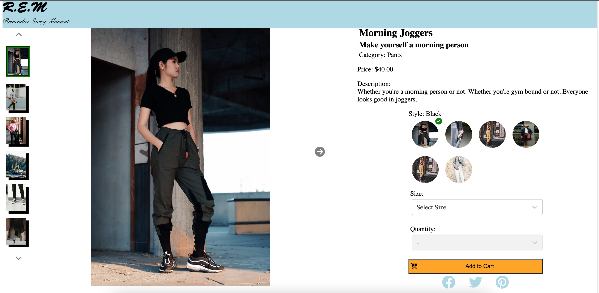

# FrontEndCapstone-EcommercePage

The goal of this project was to create a front end page that could be used for an ecommerce website.

Main tech stack:
  React - Front end
  Axios - API requests
  Express - Back end (mainly used to optimize and to serve to AWS)
  Webpack - To put everything together

## Overview

  The overview is the top module of the webpage and allows the user to get information about the product, browse the styles and optionally add the product to a cart. The elements of this module includes:

  1. Image Gallery
  2. Product Information
  3. Style Selector
  4. Add to Cart

### Image Gallery

Feature: Allows user to browse through different images of the selected style of the selected product. Users may navigate by using thumbnails on the left side of the main image or by using the arrows. Also includes an expanded image function which users can click into and zoom in even further.

Breakdown: Everything is kept track by a react useState. This state exists in a parent component while the actual display of the images exists in children components. Since there is a single state, all image displaying components know exactly what to display!

### Product Information

Feature: Displays information about the product. The information is retrieved via API requests so nothing is hardcoded! Stars are accurate up to quarter star ratings. If an item is on sale, the original price will be crossed out and the new sale price will appear in bright red.

Breakdown: Not too much to breakdown here. The main tech here is simply doing API requests to get information to populate the fields.

### Style Selector

Feature: Shows and allows users to select different styles. Will show all avaliable styles, this also controls how every other element in the module works. For example, image displayed will be based on style selected.

Breakdown: The style state is at the highest level since this state is relevant to EVERY element.
  * Image Gallery: Needs to know style so it knows what image to display
  * Product Information: Needs to know style to know what price to display/if it's on sale.
  * Add To Cart: Needs to know style so it knows what sizes and how much of each quantity is in stock.

### Add to Cart

Feature: Allows user to choose size and quantity to add to cart. If there is no quantity, all options will be greyed out and disabled.

Breakdown: Add to cart options are completely controlled by the style state. Whenever the style state is updated, the Add to Cart component will scan through avaliable options by style and update the dropdown choices accordingly.

## Related Products

  The Related Items & Outfits module will display two sets of related products. The first set will be a list of products, determined internally, that are related to the product currently being viewed. The second set will be a list, custom created by the user, of products which the user has grouped with the current product into an ‘outfit’.

  1. Related Items
  2. Outfit List

### RelatedItems

The related product lists will consist of cards. Each card will display the information for a single product.

  1. Product Category
  2. Product Name
  3. Price - As the price is not actually derived from the product, the price displayed should be that for the default style. Sale prices should be reflected. If the style is currently discounted, then the sale price should appear in red, followed by the original price which is struckthrough.
  4. Star Rating (# of Reviews) - Each product has an average rating based on its reviews. The average rating of the product will be displayed in the format of solid or outlined stars, where the solid stars represent the review score. A total of 5 stars should always appear, and the amount filled in should correspond to the average score.

The product card displays preview images of the related products. The images which appear on the product card should be the same that appear in the Overview module on the item detail page for that product.

Related product lists will be shown as a list of product cards displayed in a carousel fashion scrolling horizontally. When the first card is all the way on the left of the screen, and no previous cards exist to display, the left arrow should be hidden. This will be the case on initial page load. Similarly, when the last card appears on the far right of the list, the right arrow will be hidden.

The action button on cards within the Related Products list will appear as a star icon. The button will open a modal window comparing the details of the product of the current page to those of the product that was selected from the list.

The comparison modal window will pull up and compare the characteristics present for each product. The modal should be titled “Comparing”. The characteristics to be compared are the same as those which appear on the Overview module for each product separately.

### Outfit List

A second list of products will appear below the standard Related Products section. It will contain products which the user has selected to group together as an outfit. This list will have the same format as the related products section, and will display the same product cards in a carousel like list. This list will be titled “Your Outfit”.

Unlike the related products list that appears first, the products which appear in this list will not be determined internally, but will be unique to each user. Items will be added to the list only when a user explicitly selects them to be added.

Also unlike the related products list, the first card that appears on the left hand side of the list should not contain a product. Instead the card should display a ‘+’ icon and read “Add to Outfit”. This card will act as a button that adds the currently viewed product to the outfit list.

A product can only be added to an outfit once. While the card to “Add to Outfit” should remain visible, clicking it will not add the item a second time. There is no maximum limit on the number of items a user may add to their outfit.
Each customer will have one outfit list. This list will be the same regardless of which product detail page they are viewing. Therefore, the list items should persist across page navigation.
The list should persist for each customer even if they exit the website and return at a later time.

The action button on cards within the Related Products list will appear as an ‘X’ icon. The button will remove the product from the Outfit list.